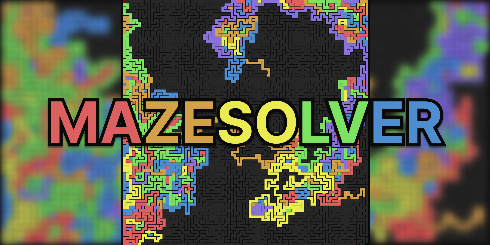

# MazeSolver

> **Progetto scolastico in Java** che utilizza il **multithreading** per risolvere un labirinto generato casualmente. Grazie a un'interfaccia grafica interattiva, il progetto rende visibile il comportamento dei thread mentre esplorano il labirinto.

<p align="center">
  
</p>

---

## Sommario
- [Caratteristiche Principali](#caratteristiche-principali)
- [Funzionamento](#funzionamento)
- [Installazione e Utilizzo](#installazione-e-utilizzo)
- [Struttura del Progetto](#struttura-del-progetto)
- [Contributi e Sviluppi Futuri](#contributi-e-sviluppi-futuri)
- [Licenza](#licenza)

---

## Caratteristiche Principali

- **Interfaccia Grafica Interattiva**  
  Il programma utilizza una GUI (`mazesolver.Gui`) per visualizzare il labirinto e i "serpenti" (thread) in azione.

- **Generazione Casuale del Labirinto**  
  Ogni esecuzione crea un nuovo labirinto grazie alla classe `mazesolver.MazeGenerator`.

- **Multithreading e Visualizzazione in Tempo Reale**  
  - Ogni thread viene rappresentato graficamente e si sdoppia ad ogni bivio.
  - L'algoritmo di risoluzione (`mazesolver.RisolviLabirintoThr`) gestisce i thread e la loro velocità (`Speed`).

- **Impostazioni Personalizzabili**  
  La classe `mazesolver.Impostazioni` suggerisce la possibilità di personalizzare il comportamento del programma.

- **Supporto ai Temi di Sistema**  
  La classe `mazesolver.ThemeDetector` potrebbe adattare i colori della GUI al tema del sistema operativo.

---

<p align="center">
  
</p>

## Funzionamento

1. **Generazione del Labirinto**  
   Il programma crea una struttura casuale con percorsi e pareti.

2. **Avvio della GUI e dei Thread**  
   - Viene avviata l'interfaccia grafica (`mazesolver.Gui`).
   - Il thread principale si sdoppia alla prima biforcazione, creando più thread che esplorano in parallelo.

3. **Esplorazione e Risoluzione**  
   - I thread avanzano indipendentemente.
   - Quando un thread trova l'uscita, il programma evidenzia il percorso e termina.

---

## Installazione e Utilizzo

1. **Scarica ed esegui il file JAR**  
   Assicurati di avere Java 8+ installato, poi esegui:
   ```bash
   java -jar MazeSolver.jar
   ```

2. **Interagisci con l'interfaccia**  
   - Osserva i "serpenti" muoversi nel labirinto.
   - Modifica eventuali impostazioni per testare differenti scenari.

---

## Struttura del Progetto

Il progetto contiene le seguenti classi principali:

```
MazeSolver.jar
│
├─ mazesolver/
│   ├─ Gui.class                 # Interfaccia grafica
│   ├─ Impostazioni.class         # Opzioni di configurazione
│   ├─ Labirinto.class            # Struttura del labirinto
│   ├─ MazeGenerator.class        # Algoritmo di generazione
│   ├─ RisolviLabirintoThr.class  # Thread per la risoluzione
│   ├─ ThemeDetector.class        # Rilevamento tema OS
└─ ...
```

---

## Contributi e Sviluppi Futuri

- **Nuovi Algoritmi di Generazione**: DFS, Kruskal, Prim, ecc.
- **Miglioramenti nell'Interfaccia**: più opzioni di personalizzazione.
- **Ottimizzazione del Multithreading**: riduzione dei thread "zombie".
- **Analisi delle Performance**: confronto tra diversi algoritmi di ricerca.

---

## Licenza

Questo progetto è distribuito sotto la licenza [MIT](LICENSE). Sentiti libero di utilizzarlo e modificarlo.

---

**Buona esplorazione con *MazeSolver*!** 🚀

<p align="center">
  
</p>
